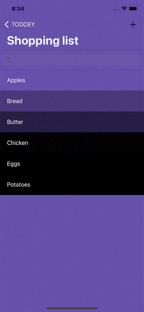
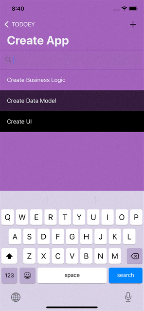
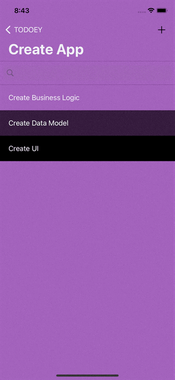

#  Установка
1. Убедиться, что на компьютере установлен [CocoaPods](https://cocoapods.org/)
2. В папке с проектов выполнить команду:
```
pod install
```
3. Открыть файл Todoey.xcworkspace

#  О приложении
Простой трекер задач, в котором можно создавать списки (категории):


В категориях можно добавлять задачи:


Задачи можно помечать как выполненные:



В задачах можно искать нужные элементы:



Можно удалять свайпом влево как категории, так и сами задачи:


